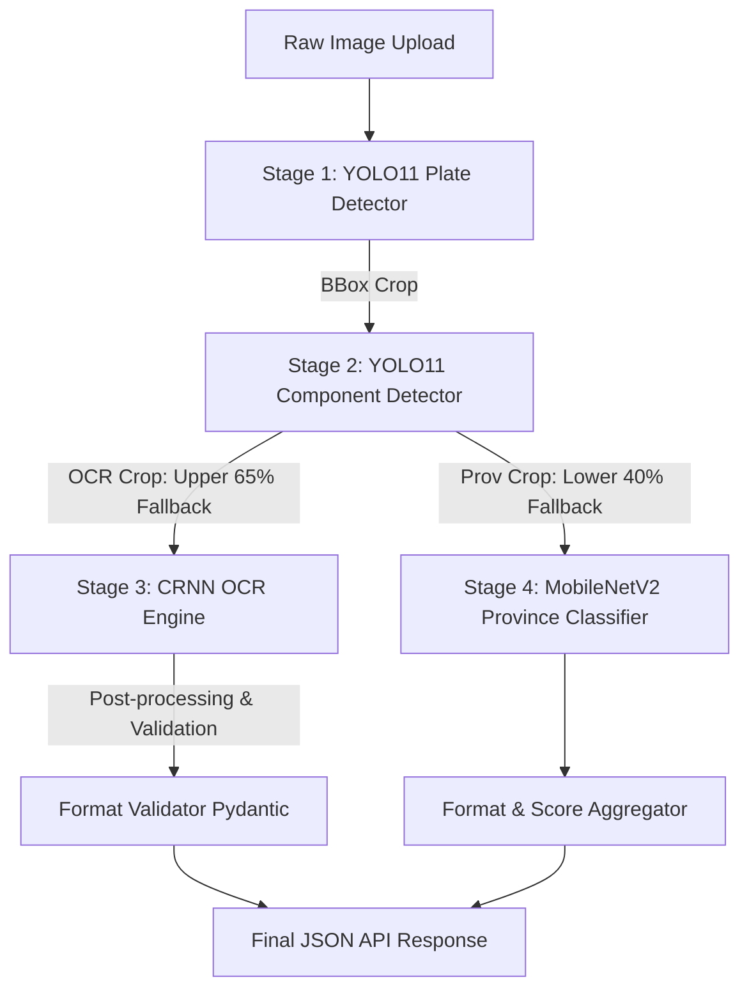

# Thai License Plate Recognition (LPR) & Province Classification API

A high-performance, containerized microservice API for Thai license plate detection, component segmentation, character recognition (OCR), and province classification.

This project is built using a multi-stage deep learning pipeline, integrating YOLO11, a custom CRNN (ResNet + BiLSTM + CTC), and a MobileNetV2 classifier.

---

## 📸 Pipeline Overview & Visuals

### Detection & Recognition Results
| Detection | Segmentation | Recognition |
|:---------:|:---------:|:------------------:|
|  |  |   |

### System Workflow
| WorkFlow |
|:------------------:|
|  |

---

## 📐 System Architecture

The recognition process uses a **4-stage inference pipeline**:



1. **Stage 1: Plate Detection**
   - Powered by [plate_detector.pt](file:///c:/Users/yourh/Desktop/PersonalProject/Thai-License-Plate-Recognition-API/weights) (YOLO11).
   - Locates and crops the license plate bounding box from the raw uploaded image.
2. **Stage 2: Component Segmentation & Cropping**
   - Powered by [component_detector.pt](file:///c:/Users/yourh/Desktop/PersonalProject/Thai-License-Plate-Recognition-API/weights) (YOLO11).
   - Extracts the specific region containing alphanumeric text (`Plate` class) and province characters (`Province` class).
   - *Fallback Mechanism:* If the detector fails to find either component, it slices the cropped plate dynamically (top 65% for OCR, bottom 40% for Province).
3. **Stage 3: License Plate Text Recognition (OCR)**
   - Powered by a custom [ResNetCRNN](file:///c:/Users/yourh/Desktop/PersonalProject/Thai-License-Plate-Recognition-API/src/models.py#L5-L51) model (ResNet18 backbone + BiLSTM + Connectionist Temporal Classification (CTC) loss).
   - Handled by `ocr_model.pth`. Uses [int_to_char.json](file:///c:/Users/yourh/Desktop/PersonalProject/Thai-License-Plate-Recognition-API/weights/int_to_char.json) for decoding.
4. **Stage 4: Province Classification**
   - Powered by a custom [ProvinceClassifier](file:///c:/Users/yourh/Desktop/PersonalProject/Thai-License-Plate-Recognition-API/src/models.py#L53-L66) model (MobileNetV2 backbone fine-tuned for classification).
   - Handled by `province_model.pth`. Uses class maps dynamically embedded in the checkpoint dictionary.

---

## 📂 Project Structure & Codebase Map

An overview of key files to help AI agents navigate the workspace:

- 📁 **`src/`** - Python source code for logic, backend, and training:
  - 📄 [config.py](file:///c:/Users/yourh/Desktop/PersonalProject/Thai-License-Plate-Recognition-API/src/config.py) - Master configuration module (paths, device configuration, hyperparameters, target dimensions, augmentation limits).
  - 📄 [api_server.py](file:///c:/Users/yourh/Desktop/PersonalProject/Thai-License-Plate-Recognition-API/src/api_server.py) - FastAPI server containing the pipeline orchestration, fallback slicing, inference logic, and the `/detect` endpoint.
  - 📄 [models.py](file:///c:/Users/yourh/Desktop/PersonalProject/Thai-License-Plate-Recognition-API/src/models.py) - Neural network definitions for the CRNN OCR engine (`ResNetCRNN`), the Province Classifier (`ProvinceClassifier`), and the CTC `best_path_decode` utility.
  - 📄 [validators.py](file:///c:/Users/yourh/Desktop/PersonalProject/Thai-License-Plate-Recognition-API/src/validators.py) - Regex and Pydantic validation schemas to enforce strict Thai plate formatting.
  - 📄 [preprocess.py](file:///c:/Users/yourh/Desktop/PersonalProject/Thai-License-Plate-Recognition-API/src/preprocess.py) - Text and image preprocessing transforms including `SmartResize` (aspect-ratio preserving padded resize) and histogram enhancement.
  - 📄 [datasets.py](file:///c:/Users/yourh/Desktop/PersonalProject/Thai-License-Plate-Recognition-API/src/datasets.py) - PyTorch dataset loaders. Includes synthetic generators `SyntheticOCRDataset` and `SyntheticProvinceDataset` using Windows/system fonts (`THSarabunNew`, `Tahoma`) to balance out rare classes.
  - 📄 [prepare_from_yolo.py](file:///c:/Users/yourh/Desktop/PersonalProject/Thai-License-Plate-Recognition-API/src/prepare_from_yolo.py) - Extracts cropped plate and province dataset elements from raw YOLO segmentation datasets to create structured training datasets.
  - 📄 [train_ocr.py](file:///c:/Users/yourh/Desktop/PersonalProject/Thai-License-Plate-Recognition-API/src/train_ocr.py) - Multi-task trainer class for both the CRNN model and the MobileNetV2 province classifier.
  - 📄 [train_yolo.py](file:///c:/Users/yourh/Desktop/PersonalProject/Thai-License-Plate-Recognition-API/src/train_yolo.py) - Custom scripts to invoke Ultralytics YOLO training for detection and segmentation tasks.
  - 📄 [test.py](file:///c:/Users/yourh/Desktop/PersonalProject/Thai-License-Plate-Recognition-API/src/test.py) - Evaluation scripts to benchmark OCR Character Error Rate (CER), Province accuracy, and strict format compliance rates.
- 📁 **`weights/`** - Trained checkpoints and maps:
  - 📄 [int_to_char.json](file:///c:/Users/yourh/Desktop/PersonalProject/Thai-License-Plate-Recognition-API/weights/int_to_char.json) - Integer-to-character vocabulary index for CRNN OCR decoding.
- 📄 [requirements.txt](file:///c:/Users/yourh/Desktop/PersonalProject/Thai-License-Plate-Recognition-API/requirements.txt) - Locked packages required to build and execute the service.
- 📄 [Dockerfile](file:///c:/Users/yourh/Desktop/PersonalProject/Thai-License-Plate-Recognition-API/Dockerfile) - Production-ready Docker recipe matching GCP Cloud Run specifications.
- 📄 [GPC_Powershell.txt](file:///c:/Users/yourh/Desktop/PersonalProject/Thai-License-Plate-Recognition-API/GPC_Powershell.txt) - Command references for Google Cloud Platform (GCP) artifact registry building and deployment.

---

## 🛠️ Technical Stack & Library Rationale

- **AI/ML Core:**
  - `torch` & `torchvision`: Framework for defining/loading custom deep neural nets (ResNet18 + BiLSTM + MobileNetV2).
  - `ultralytics` (YOLO11): Leading standard for rapid real-time multi-object detection and segmentation.
  - `scikit-learn` & `editdistance`: For metrics computation (F1-macro, Levenshtein Distance for CER).
- **Backend & Validation:**
  - `fastapi` & `uvicorn`: Ultra-low latency Python ASGI web frameworks, providing automatic openAPI docs.
  - `pydantic`: Standardized structural validation. Forces OCR string outputs into compliance, flagging deviations.
- **Image Processing:**
  - `pillow`: Standard Python Image Library (PIL) for crop manipulation, custom synthetic font rendering, and padding.
  - `opencv-python-headless`: Required for lightweight headless Docker images running matrix operations.

---

## 🛑 Strict Thai License Plate Validation Rules

The OCR engine checks character predictions against three standard format regex rules:

1. **`NCC NNNN`** (Consonant + Number Pattern)
   - *Example:* `1กข 1234`
   - *Regex:* `^\d[\u0E01-\u0E2E]{2} \d{1,4}$`
2. **`CC NNNN`** (Consonant Only Pattern)
   - *Example:* `กข 1234`
   - *Regex:* `^[\u0E01-\u0E2E]{2} \d{1,4}$`
3. **`NN-NNNN`** (Truck/Commercial Plate Pattern)
   - *Example:* `70-1234`
   - *Regex:* `^\d{2}-\d{4}$`

*Note: Thai consonants are strictly checked within the range `\u0E01-\u0E2E` (Ko Kai to Ho Nokhuk).*

---

## 🚀 Running Locally

### 1. Installation
Clone the repository and install dependencies inside a virtual environment:
```bash
pip install -r requirements.txt
```

### 2. Run API Server
Start the FastAPI server locally:
```bash
uvicorn src.api_server:app --host 0.0.0.0 --port 8000
```
*Access interactive documentation at `http://localhost:8000/docs`.*

### 3. API Usage Reference
* **Endpoint:** `POST /detect`
* **Payload Format:** `multipart/form-data` with key `file` containing the binary image.
* **Sample Response:**
```json
{
  "status": "success",
  "results": [
    {
      "plate_text": "1กข 1234",
      "province": "กรุงเทพมหานคร",
      "confidence": {
        "plate_detection": 0.942,
        "province": 0.985
      }
    }
  ],
  "latency_ms": 114
}
```

---

## 🏋️ Training & Evaluation

### Training YOLO11 Models
Run [train_yolo.py](file:///c:/Users/yourh/Desktop/PersonalProject/Thai-License-Plate-Recognition-API/src/train_yolo.py) targeting either detection, segmentation, or both:
```bash
python -m src.train_yolo --task detect --epochs 100
python -m src.train_yolo --task segment --epochs 100
```

### Training OCR & Province Classifier
Use [train_ocr.py](file:///c:/Users/yourh/Desktop/PersonalProject/Thai-License-Plate-Recognition-API/src/train_ocr.py) to train either of the custom PyTorch architectures:
```bash
python -m src.train_ocr --task province --epochs 100
python -m src.train_ocr --task ocr --epochs 100
```

### Running System Benchmarks
Run [test.py](file:///c:/Users/yourh/Desktop/PersonalProject/Thai-License-Plate-Recognition-API/src/test.py) on your validation datasets to compute metrics:
```bash
python -m src.test --csv crops_all/test/test_unified.csv --crops crops_all/
```

---

## 🐳 Docker & GCP Cloud Run Deployment

Refer to [GPC_Powershell.txt](file:///c:/Users/yourh/Desktop/PersonalProject/Thai-License-Plate-Recognition-API/GPC_Powershell.txt) for instructions.

### 1. Build and Tag Docker Image
```bash
docker build -t asia-southeast1-docker.pkg.dev/[PROJECT_ID]/[REPO_NAME]/thai-lpr-api:latest .
```

### 2. Push to Google Artifact Registry
```bash
gcloud auth configure-docker asia-southeast1-docker.pkg.dev
docker push asia-southeast1-docker.pkg.dev/[PROJECT_ID]/[REPO_NAME]/thai-lpr-api:latest
```

### 3. Deploy to Cloud Run
```bash
gcloud run deploy thai-lpr-api \
  --image asia-southeast1-docker.pkg.dev/[PROJECT_ID]/[REPO_NAME]/thai-lpr-api:latest \
  --region asia-southeast1 \
  --platform managed \
  --allow-unauthenticated \
  --memory 2Gi \
  --max-instances 1 \
  --min-instances 0 \
  --cpu-throttling
```
