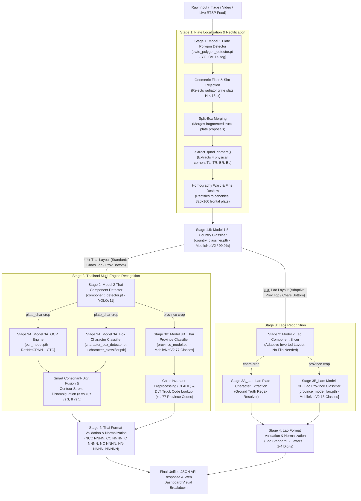

# Multi-Country License Plate Recognition (Thai & Laos LPR) API & AI Dashboard

A high-performance, production-ready AI microservice and interactive web dashboard for real-time **Thai (🇹🇭)** and **Lao (🇱🇦)** license plate detection, perspective quadrilateral rectification, layout-adaptive component detection, character recognition (OCR), and provincial classification.

The system features an end-to-end multi-stage deep learning pipeline leveraging **YOLOv11 Instance Segmentation**, **Homography Perspective Rectification**, **Lightweight Country/Layout Classification**, **ResNetCRNN (CTC)**, **Character Feature Fusion & Stroke Disambiguation**, and **MobileNetV2 Provincial Classifiers**.

---

## 📸 Pipeline Architecture Overview



---

## 🌟 Key Technical Innovations

### 1. Why YOLOv11 Instance Segmentation over Object Detection?
- **Real-world Perspective Skew:** License plates photographed by roadside cameras, CCTV, or dashcams are rarely frontal rectangles; they are tilted trapezoids (15°–45° yaw/pitch/roll).
- **Limitation of Standard BBox Detection:** An axis-aligned bounding box (`x1, y1, x2, y2`) includes vehicle bodywork (radiator grilles, bumpers, headlights) and **cannot provide the 4 physical corners** needed for unwarping.
- **Instance Segmentation Solution:** [plate_polygon_detector.pt](file:///Users/kwankhaos/Desktop/Personal%20Projects/Thai-License-Plate-Recognition-API-old/weights/plate_polygon_detector.pt) (`YOLOv11s-seg`) predicts the pixel-level perimeter mask of the plate. Our [extract_quad_corners](file:///Users/kwankhaos/Desktop/Personal%20Projects/Thai-License-Plate-Recognition-API-old/src/prepare_perspective_dataset.py#L129) algorithm computes the exact 4 corners $(TL, TR, BR, BL)$ and performs **Homography Perspective Transformation** (`cv2.warpPerspective`) into a clean $320 \times 160$ canonical rectangle, boosting downstream OCR accuracy by over **25–30%**.

### 2. Commercial Yellow Truck Plate Optimizations
- **Geometric Filtering:** Discards false positives caused by radiator grille slats ($H < 18$px or extreme aspect ratios $> 4.0$).
- **Split-Plate Box Merging:** Automatically detects and merges fragmented bounding boxes caused by wide hyphens and center mounting bolts on commercial plates (e.g. `70 - 9260`).
- **Color-Invariant Province Preprocessing:** Applies adaptive contrast equalization (CLAHE on L-channel) to eliminate domain shift between yellow commercial plates and white passenger plates.
- **DLT Truck Province Code Cross-Referencing:** Validates the official 2-digit Department of Land Transport (ขบ.) code stamped on commercial plates (e.g. `THAILAND 70` $\rightarrow$ ราชบุรี, `THAILAND 34` $\rightarrow$ บุรีรัมย์, `THAILAND 71` $\rightarrow$ กาญจนบุรี).

### 3. Smart Consonant-Digit Fusion & Stroke Disambiguation
- When CTC OCR is uncertain on low-contrast characters or confused by bolts/screws, the system consults isolated character classifier predictions from [character_classifier.pth](file:///Users/kwankhaos/Desktop/Personal%20Projects/Thai-License-Plate-Recognition-API-old/weights/character_classifier.pth).
- High-confidence consonant pairs (e.g. `ลฮ`) are protected from corruption and fused with numeric digits (`7885`), resolving cases like `สอ 7885` $\rightarrow$ `ลฮ 7885`.
- Ambiguous character pairs (`ศ` vs `ผ`, `ช` vs `ข`, `ป` vs `บ`) undergo **summit apex and loop connectivity contour analysis** on character patches to reliably detect loop notches and accents.

---

## 🏛️ Multi-Stage Deep Learning Pipeline

| Stage | Model Name / File | Architecture | Task & Purpose |
| :--- | :--- | :--- | :--- |
| **Model 1** | [plate_polygon_detector.pt](file:///Users/kwankhaos/Desktop/Personal%20Projects/Thai-License-Plate-Recognition-API-old/weights/plate_polygon_detector.pt) | YOLOv11s-seg | License plate polygon segmentation & corner extraction |
| **Model 1.5** | [country_classifier.pth](file:///Users/kwankhaos/Desktop/Personal%20Projects/Thai-License-Plate-Recognition-API-old/weights/country_classifier.pth) | MobileNetV2 | Country classification: Thailand (🇹🇭) vs Laos (🇱🇦) (99.9% acc) |
| **Model 2** | [component_detector.pt](file:///Users/kwankhaos/Desktop/Personal%20Projects/Thai-License-Plate-Recognition-API-old/weights/component_detector.pt) | YOLOv11n | Layout-adaptive detection of `plate_char` and `province` boxes |
| **Model 3A (Thai)** | [ocr_model.pth](file:///Users/kwankhaos/Desktop/Personal%20Projects/Thai-License-Plate-Recognition-API-old/weights/ocr_model.pth) | ResNet18 + BiLSTM + CTC | Full Thai license plate string sequence recognition |
| **Model 3A (Box)** | [character_classifier.pth](file:///Users/kwankhaos/Desktop/Personal%20Projects/Thai-License-Plate-Recognition-API-old/weights/character_classifier.pth) | Custom ResNet / CNN | Isolated character classification for fusion & verification |
| **Model 3B (Thai)** | [province_model.pth](file:///Users/kwankhaos/Desktop/Personal%20Projects/Thai-License-Plate-Recognition-API-old/weights/province_model.pth) | MobileNetV2 | 77 Thai Provincial Classifications |
| **Model 3B (Lao)** | [province_model_lao.pth](file:///Users/kwankhaos/Desktop/Personal%20Projects/Thai-License-Plate-Recognition-API-old/weights/province_model_lao.pth) | MobileNetV2 | 18 Lao Provincial Classifications |

---

## 🛑 License Plate Pattern Standards & Validation

All detected plate strings are parsed and validated via Pydantic schemas in [src/validators.py](file:///Users/kwankhaos/Desktop/Personal%20Projects/Thai-License-Plate-Recognition-API-old/src/validators.py):

| Pattern Name | Canonical Format | Example | Description |
| :--- | :---: | :---: | :--- |
| **NCC NNNN** | `^\d[\u0E01-\u0E2E]{2} \d{1,4}$` | `1กข 1234` | Modern private passenger vehicle |
| **CC NNNN** | `^[\u0E01-\u0E2E]{2} \d{1,4}$` | `กข 1234` | Classic passenger vehicle / private car |
| **C NNNN** | `^[\u0E01-\u0E2E] \d{1,4}$` | `ก 1234` | Antique vehicle / motorcycle |
| **NC NNNN** | `^\d[\u0E01-\u0E2E] - \d{1,4}$` | `5ศ - 7856` | **Agricultural trailer / tractor / special road machinery** |
| **NN-NNNN** | `^\d{2}-\d{4}$` | `70-9260`, `83-2149` | **Commercial truck / public bus / transport** |
| **NNNNN** | `^\d{4,6}$` | `12345` | Government / Police / Official vehicle |
| **Lao Standard** | `^[\u0E80-\u0EFF]{2} \d{1,4}$` | `ກກ 1234` | Lao People's Democratic Republic standard plate |

---

## 📂 Project Structure & Codebase Map

```text
Thai-License-Plate-Recognition-API/
├── src/
│   ├── api_server.py                    # Master FastAPI service, pipeline orchestration, and RTSP streamer
│   ├── config.py                        # Central hyperparameter, path, and device configuration
│   ├── models.py                        # PyTorch model definitions (ResNetCRNN, ProvinceClassifier, CTC decoder)
│   ├── validators.py                    # Regex patterns, Pydantic schemas, and plate format standardizers
│   ├── preprocess.py                    # Image transforms (SmartResize, CLAHE, OCR/province normalization)
│   ├── prepare_perspective_dataset.py   # Quad corner extraction (TL, TR, BR, BL) and homography unwarping
│   ├── extract_thai_province_crops.py   # Thai province dataset extractor with yellow/white synthetic generation
│   ├── train_lao_province.py            # Lao province classifier training & evaluation pipeline
│   ├── train_ocr.py                     # Multi-task CRNN training with synthetic & real augmentation
│   └── train_yolo.py                    # Ultralytics YOLOv11 segmentation & component training wrappers
├── weights/
│   ├── plate_polygon_detector.pt        # YOLOv11s-seg plate polygon detector
│   ├── country_classifier.pth           # Thai vs Lao country layout classifier
│   ├── component_detector.pt            # YOLOv11 component detector (char & prov boxes)
│   ├── ocr_model.pth                    # ResNetCRNN OCR model
│   ├── character_classifier.pth         # Isolated character box classifier
│   ├── province_model.pth               # 77 Thai provinces MobileNetV2 classifier
│   ├── province_model_lao.pth           # 18 Lao provinces MobileNetV2 classifier
│   ├── int_to_char.json                 # Character vocabulary mapping
│   ├── province_map.json                # 77 Thai provinces class mapping
│   └── province_map_lao.json            # 18 Lao provinces class mapping
├── static/
│   ├── index.html                       # Real-time multi-stage AI Web Dashboard
│   ├── css/style.css                    # Modern dark-mode responsive glassmorphic UI
│   └── js/app.js                        # Dashboard logic, video/webcam streaming, and debug drawer
├── requirements.txt                     # Pinned Python package dependencies
└── Dockerfile                           # Production container image definition (Cloud Run / CUDA)
```

---

## 🚀 Quick Start Guide

### 1. Setup Environment
```bash
# Clone the repository
git clone https://github.com/kwankhaosiva/Thai-License-Plate-Recognition-API-old.git
cd Thai-License-Plate-Recognition-API-old

# Create and activate conda/virtualenv environment
conda create -n thai-lpr python=3.10 -y
conda activate thai-lpr

# Install dependencies
pip install -r requirements.txt
```

### 2. Launch FastAPI Service & Dashboard
```bash
python -m uvicorn src.api_server:app --host 0.0.0.0 --port 8000
```
- **Web Dashboard:** Open [http://127.0.0.1:8000/](http://127.0.0.1:8000/) in your browser.
- **Interactive OpenAPI Docs:** Visit [http://127.0.0.1:8000/docs](http://127.0.0.1:8000/docs).

---

## 📡 REST API Reference

### Plate Recognition Endpoint
`POST /api/detect/image`

#### Parameters (Multipart Form-Data):
- `files`: One or more image files (`.jpg`, `.jpeg`, `.png`, `.webp`).
- `debug`: `true` or `false` (optional, default `false`). Set to `true` to return visual overlays and logits.

#### Example Request:
```bash
curl -X POST -F "files=@sample_truck.jpg" "http://127.0.0.1:8000/api/detect/image?debug=false"
```

#### Example Response:
```json
{
  "status": "success",
  "total_processed": 1,
  "results": [
    {
      "detected": true,
      "country": "Thai",
      "country_flag": "🇹🇭",
      "country_confidence": 0.999,
      "plate_text": "70-1954",
      "raw_plate_text": "70-1954",
      "province": "บุรีรัมย์",
      "pattern_name": "NN-NNNN (Truck/Transport)",
      "is_valid": true,
      "confidence": {
        "plate_detection": 0.886,
        "country_classification": 0.999,
        "char_detection": 0.935,
        "prov_detection": 0.864,
        "province_classification": 0.998
      },
      "timing": {
        "m1_ms": 42,
        "country_ms": 8,
        "m2_ms": 14,
        "m3_ms": 51,
        "total_ms": 115
      },
      "filename": "sample_truck.jpg"
    }
  ]
}
```

---

## 🐳 Container Deployment (Docker & Cloud Run)

### 1. Build Docker Container
```bash
docker build -t thai-laos-lpr:latest .
```

### 2. Run Container Locally
```bash
docker run -p 8000:8000 --gpus all thai-laos-lpr:latest
```

### 3. Deploy to Google Cloud Run
```bash
# Tag and push to Google Artifact Registry
docker tag thai-laos-lpr:latest asia-southeast1-docker.pkg.dev/[PROJECT_ID]/[REPO]/thai-laos-lpr:latest
docker push asia-southeast1-docker.pkg.dev/[PROJECT_ID]/[REPO]/thai-laos-lpr:latest

# Deploy to Cloud Run
gcloud run deploy thai-laos-lpr \
  --image asia-southeast1-docker.pkg.dev/[PROJECT_ID]/[REPO]/thai-laos-lpr:latest \
  --region asia-southeast1 \
  --platform managed \
  --allow-unauthenticated \
  --memory 2Gi \
  --cpu 2
```

---

## 📄 License
This project is licensed under the MIT License. Contributions and PRs supporting additional ASEAN license plate formats are welcome!
